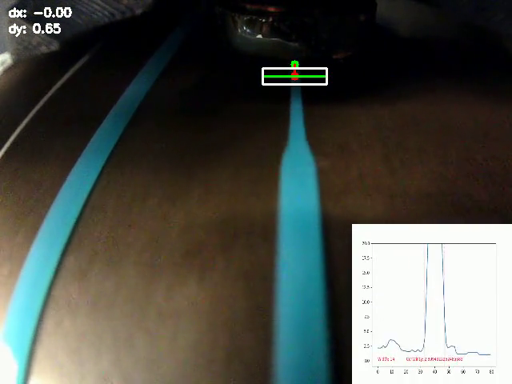

# Generating Dynamical Models of Extrudate Flow

> Originally published to https://github.com/jakeread/generating-extrudate-flow-models in the wee hours of March 11th, 2025 

> Mirrored to https://gitlab.cba.mit.edu/jakeread/generating-extrudate-flow-models on March 13th, 2025 

> I hereby dedicate the contents of this disclosure to the public domain so that it may serve as prior art.  

3D Printers spend most of their time accelerating and deccelerating because their motion platforms are controlled by actuators with limited torque, and their structures and transmissions deflect during changes to velocity of the end effector. These physical limits, combined with limits to flowrate (and some other details) are the main limit 3D printing speed. Controlling flow under these dynamical conditions (stopping and starting) presents challenges to printer controllers (and parameter tuners) that can be overcome in a sensible way using models of the flow. 

However, models are difficult to build because flow is difficult to measure directly, and instead we need to rely on indirect measurements - normally measuring track width in a test article where we have prior knowledge of motor speeds. In this disclosure, I show how I currently accomplish this (in a manner similar to many other pieces of prior art), and expand to explain a system I am currently implementing, which extends the prior art to enable us to capture flow data for arbitrary geometries - i.e. at each new layer or subsection of a print. 

| With 100mm/sec Feedrate | With 500mm/sec Feedrate |
| --- | --- |
|  |  |
|  |  |
> Here I show the result of two print layers that have been optimized by a trapezoidal motion solver (the likes of which are present in most machine control firmwares). In both cases, acceleration is limited to **1000mm/sec^2.** At the left, we target 100mm/sec feedrate and the histogram shows that the resulting path is executed mostly at that feedrate. On the right, we target 500mm/sec, but see that this speed is *never reached* during the print: the job is acceleration dominated and instead of seeing a 5x increase in speed, we realize only 14% increase... the machine effectively spends 100% of its operating time accelerating, where flow dynamics become messy. 

The most obvious type of dynamical information we need to understand is extrudate compression: when we apply a linear increase in pressure to the material we are depositing, it does not result in a linear increase in flow. Instead, the extrudate squishes somewhat, generating pressure, and then that pressure results in more flow. In most 3D printer firmwares, the compensation for this is known as *linear advance* and the required model is... linear! 

  
> A diagram of an FFF printer's basic phenomena. Filament between the drive gear and nozzle is compressible, leading to some nasty extrusion dynamics. Extrusion is further complicated by nonlinear shear thinning of materials, die swell of extrudate processed at high pressures, and many more parameters.  While this disclosure largely discusses FFF printing, the principles can be easily applied to pellet extruders, syringe extruders, pump extruders, etc - just about anything where a flow can be modelled and controlled. 

> Poorly understood filament dynamics can lead to extrusion errors when machines turn corners or slow down and speed up. A common heuristic remedy for this problem is known as 'linear advance,' but it is difficult to tune and misses nonlinear properties of extrudate flow dynamics. [via the Prusa Knowledge Base](https://help.prusa3d.com/article/linear-advance_2252)

There is much more to it: flow is nonlinear with respect to pressure due to shear thinning properties of polymer melt flows (and many other types of extrudate). The temperature of a flow may change over time; even with constant nozzle set-points, the actual flow temperature fluctuates when the material spends more or less time in the heating element during slow or fast motion respectively. Capturing all of these phenomena in classic models is difficult, and so we and others are making efforts to develop data-based models. 

If we had really good models of melt flow rheology and its relationship to polymer material properties across a range of temperatures and shear rates, it may be possible to build feed-forward flow models, but (1) those models are nasty and nonlinear, (2) there is lots of other hidden, unmeasured state (like exact flow pressures and shear rates) (and melt flow temperature, which as mentioned is not identical to nozzle setpoint temperature!) and (3) we often don't know exactly what polymers we are printing, since we buy them from many different vendors, etc etc - nozzle internal geometries may also be unknown, as would be the actual force exerted by our motors, etc. We need flow data!

## Capturing Flow-Rate Data 

The most straightforward way to get real flow data is to measure a track width in a situation where we already know the track's height and the forward velocity that our machine had while that track was made. 

  
> This is a test article for manual calibration of *linear advance* [via the Prusa Knowledge Base](https://help.prusa3d.com/article/linear-advance_2252) - at each line, the linear advance value is updated (and printed at right). In this procedure, the test article is printed and then users select the value which produced the most even line. 

This is basically what the Bambu printers appear to do, and similarely documented in [rubedo: a system for automatically calibrating pressure advance using laser triangulation](https://github.com/furrysalamander/rubedo) as well as in [this excellent thesis by Pinyi Wu](https://deepblue.lib.umich.edu/handle/2027.42/194671). It is also similar to what I have done previously with contributions from Yuval Manana at MIT. 

  
 

|  |  |
| --- | --- |

> In the video above, I show how camera data can be used to capture line widths, which are then converted from pixels widths to flow values (using prior knowledge of the machine's velocity). These can then be correlated with the machine's extruder motor velocities at the frame capture times in one time-series dataset. 

Quality of the imaging data can be improved by adding a line laser, as is the case in most other implementations. These implementations themselves are essentially *laser profilometers,* a very well understood device figured below.

  
> An off-the-shelf laser profilometer from Micro-Epsilon. These devices project a line laser, and use an imaging device to measure the laser's position on an image plane. A few transforms later and this is turned into height data - which can be used for edge detection, volume calculations, etc. 

In the state of the art, this is done on the first layer in a mostly offline calibration routine: a canned pattern is printed, and scanners recover flow data from that pattern. However, these canned patterns cannot capture the full breadth of dynamical information that is useful in building and refining flow models. A primary limit here is that the first layer of a print is normally much slower than subsequent layers (since bed adhesion is troublesome). A second limit is that canned patterns contain smaller breadth of different dynamical states - of course, complete 3D prints are more representative of the dynamical states that a machine will typically find itself in! 

## What This Disclosure Contributes 

I have devised a procedure / system that would let us gather width (flow) information from any layer in a print. The sysem would allow our printers to learn (1) with more and higher frequency data and (2) on real in-situ data from the printers' active settings (not only on a canned routine).

This strategy would also allow us to improve measurements on the fly (3) in cases where feedstock or other processing conditions may change. Additionally (4) it would enable the printer to stop, modify, or save data about ongoing prints for future use in industrial verification, part traceability, and collect detailed measurements of any print it carries out to study longer-order outcomes like part strength, layer strength and durability, by effectively scanning internal layers as they are printed.

While the implementation discussed herein is for an FFF 3D printer, the techniques could be broadly applied in pellet 3D printers, gel, clay and concrete extrusion, etc. 

### The Instrumentation 

  

Our end effector / instrument is mostly similar to an off-the-shelf extruder: it has a drive stage that pushes filament, a hotend where filament is melted, and a nozzle. We add to this instrument a downwards facing camera and angled line laser, and additional sensing equipment including a loadcell to measure flow pressure, a thermal imaging device to measure melt flow temperatures, and an input feedrate sensor to measure filament velocity and width before it enters the extruder. The extruder motor is also closed-loop and senses current, allowing us to measure its active torque. Similar instruments could be added to a pellet extruder, or gel / syringe extruder, etc. The technique does not either require these instruments: flow models could be made using simple open loop steppers and an uninstrumented hotend. The additon of instruments helps to better constrain the model and offers recourse for future development of active feedback controllers. 

> The device in it's state as of the time of writing. 

### Calibrating the Line Laser, Camera and Nozzle Positions 

Fitting the relationship between the camera, the nozzle, and the line laser is a critical step to the process.

First, the camera is calibrated using images of known targets captured at various angles and distances. This calibration essentially tells us, for each pixel in the camera, what the function of the line is that extends from that pixel. 

Next we can calibrate the nozzle's offset with respect to the camera. We are aided in this procedure by our machine's motion system: we print (or etch, draw, etc) a series of registration marks on the machine bed, and then image those marks with the camera from a different position. We can use these images to establish a spatial offset from the nozzle tip to the camera origin. 

Finally, we can calibrate the line laser by imaging it on the printer's bed. For this, we start by imaging the laser when the bed is in contact with the nozzle tip (which we can detect with the loadcell, or a littany of other bed leveling sensors - or can adjust by hand). Then, we move the bed away from the camera at fixed intervals, and image the line laser each time. From each frame, we can fit a line to the mark that the line laser leaves on the bed using peak detection - the laser is great for these tasks because it's precise color can be cleanly picked out of an image. These lines fit a plane in 3D space, relative to the camera's origin. 

We now have a complete set of arrangements between the nozzle, the camera's field of view, and the line laser's plane. This effectively turns the system into a height mapping sensor: when we image the laser's line, we get a column of pixel positions in `x, y` of the camera's image plane where the laser is the brightest. These positions can be subpixel accurate since they are fit using brightness measurements across the pixel row. Each `x` value in this column maps to one `x, y, z` position in the machine's coordinate space once we apply offsets from the calibrations and the position of the camera when the image was taken. 

### Aligning Motion and Flow In a Time-Series Dataset 

While we print, we save relevant system states into a time-series dataset. This records the machine's position in space as a function of time, and time-stamped sensor readings from the hotend's instruments. 

Once a layer is complete, we can subsequently scan the layer using the downward facing camera, taking a series of images at various positions over the part. These can be combined into one large image, or processed piecewise. The line laser helps to distinguish a new layer from those below it, but it would be possible to develop a computer vision solution that does this using imaging alone. 

Because our camera is calibrated with respect to the motion system, we can overlay our time series data onto the scanned layer. Then, at each segment of the printed path, we can take the width measurement, and (using the saved velocity at that point) back out what the flowrate was at that time. This allows us to add flowrate data to the time-series dataset. 

Width measurements can be made using any of the commonly available edge detection algorithms popular in computer vision, and are aided by the laser line scanner. 

Because the motion system encodes position as a continuous function of time, we can get exceptionally high frequency flow information, sampling the path width at any given spatial density - although in practice this is limited by the camera's resolution. The laser line scanner can also measure track heights to generate a 3D map of the layer, in the cases where they deviate from the expected layer height - this helps further refine flow information. 

The dataset can be subsequently used to improve models for melt flow, or for storage in a log of the part's history, or attached to the parts' digital twin for lifetime tracking. 
 
## Modeling Flow 

At this point we have a detailed time-series dataset where the most important output, the flowrate, is given as a nearly continuous function of time. We also have an aligned time-series of the extruder motor's velocities, as well as whichever other time-series data we have instrumented our machine with. In the current iteration of our system, this includes melt flow temperature, nozzle setpoint and temperature, motor torque, loadcell readings, accelerometer readings, and readings from a filament sensor that measures filament inflow and width. 

Using these data, we can generate or improve models for how flow relates to input states as a function of time. Models of various parts of the system can be combined:

- motor models tell us how input voltages result in torques,
- drive gear friction models tell us about the durability of filament gearing, and limits to torque exerted on input material, 
- we have models for how filament compresses in the guide path, 
- we have models for how pressure, temperature, and flowrate are related (see previous work), 
- we have models for die swell, which is related to melt flow temperature, extrudate pressure, and subsequent thermal history of the strand 

To fit models, we expose their parameters and run simulations using equivalent input states to our data, which can be motor torques, voltages, or direct motor velocities - also nozzle heater voltage inputs or setpoints. We can then measure the error between the simulations' outputs and the measured outputs, and use a gradient of those errors with respect to model parameters - basically, we optimize the exposed parameters such that the simulation most closely matches the measured data. 

  
> Here we show a model that has been fit using saved time-series data (in blue) of the extruder motor's input velocity, and data (in red) from flow measurements. The model is a simple linear compressive system whose parameters were tuned to best fit the data. The simple model clearly misses some detail, but captures the broad phenomenology. This data is generated using a simpler system than the one contained here, but the example shows how models fit to time series data... 

## Enumeration of Variations 

Principles discussed here could be applied to almost any type of extrusion: gels, clays, polymers with additives including metal powders, ... 

It should also be possible to do this using a camera or a selection of cameras that are rigidly mounted to the machine chassis, or a combination of cameras on the hotend and rigidly mounted cameras. 

The device rendered here shows a downward facing camera and angled line laser. Others may angle the camera and project the line laser vertically. In practice, any combinations of geometries are possible, and many are likely to be developed to satisfy packaging constraints. 

One or more thermal cameras could be added to the system and calibrated alongside the other devices, so that layer scans could include detailed thermal history of the part as it is being manufactured. This could further aid in developing process models, understanding part performance in the future, and attaching to the part's digital twin for later analysis, quality assurance and/or certification, and lifetime tracking. 

A number of line lasers can be used to improve height map resolution, aiding in removing occlusions. These could be turned on and off during different image captures to provide clean frames for each axis. 

Data gathered using these methods could also be used to tune heuristic models or other feed-forward controllers, rather than the (more complex) task of fitting complete models. 

Many camera and line-laser calibrations exist, and this technique can be deployed no matter which particular strategy for calibration is generated. 

## References 

I discussed this topic during my thesis proposal *on December 12th, 2024* which is included here as a [PDF](assets/jake-read-mit-thesis-proposal.pdf) and available from MIT archives on request. Slides for the proposal are public [here](https://jakeread.github.io/slides/2024-12_proposal/2024-12_proposal.html) and the proposal site is public [here](https://jakeread.github.io/thesis-proposal/) 

> Wu, Pinyi. 2024. “Modeling and Feedforward Deposition Control in Fused Filament Fabrication.”

> Rau, Daniel A., Michael J. Bortner, and Christopher B. Williams. "A rheology roadmap for evaluating the printability of material extrusion inks." Additive Manufacturing 75 (2023): 103745. 

> Silva, João M., et al. "Real-time precision in 3D concrete printing: controlling layer morphology via machine vision and learning algorithms." Inventions 9.4 (2024): 80.

> Rubedo: A system for automatically calibrating pressure advance using laser triangulation. https://github.com/furrysalamander/rubedo 

> Kazmer, David O., Austin R. Colon, Amy M. Peterson, and Sun Kyoung Kim. 2021. “Concurrent Characterization of Compressibility and Viscosity in Extrusion-Based Additive Manufacturing of Acrylonitrile Butadiene Styrene with Fault Diagnoses.” Additive Manufacturing 46 (October): 102106. https://doi.org/10.1016/j.addma.2021.102106. 